# Day 3: Combinational and Sequential Optimization

Welcome to Day 3 of this workshop! Today focuses on optimizing combinational and sequential circuits using practical techniques to improve efficiency and performance.

---

## Table of Contents

- [1. Constant Propagation](#1-constant-propagation)
- [2. State Optimization](#2-state-optimization)
- [3. Cloning](#3-cloning)
- [4. Retiming](#4-retiming)
- [5. Labs on Optimization](#5-labs-on-optimization)
  - [Lab 1](#lab-1)
  - [Lab 2](#lab-2)
  - [Lab 3](#lab-3)
  - [Lab 4](#lab-4)
  - [Lab 5](#lab-5)
  - [Lab 6](#lab-6)

---

## 1. Constant Propagation

Constant propagation is a synthesis-time optimization where signals driven by constants are tracked and replaced directly in the logic. This simplifies expressions and lets tools prune redundant gates.

How it works:
- The tool analyzes the RTL/netlist and finds signals that are always 0 or 1.
- These constants are substituted into the logic equations.
- The simplified logic reduces area and often improves timing.

Benefits:
- Reduced logic depth and gate count.
- Lower area and potentially lower power.
- Fewer nodes to analyze during timing and verification.

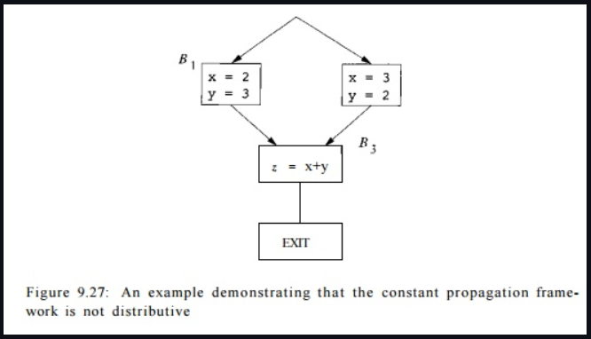

---

## 2. State Optimization

State optimization targets finite state machines (FSMs) to make them more compact and efficient without changing observable behavior.

Typical steps:
- State reduction: Merge equivalent or unreachable states.
- State encoding: Choose an encoding style (binary, Gray, one-hot, etc.) suited to timing, power, or area goals.
- Logic minimization: Simplify next-state and output logic using Boolean optimization or tools.
- Power-oriented tweaks: Use techniques such as clock gating on idle states when possible.

---

## 3. Cloning

Cloning duplicates logic blocks or cells to improve timing, reduce fanout, or shorten long interconnects.

Workflow:
- Identify critical paths or heavily loaded nets from timing reports.
- Duplicate the driver cell or logic cone.
- Split the fanout so each clone drives a subset of loads.
- Re-run place, route, and timing to confirm slack and power improvements.

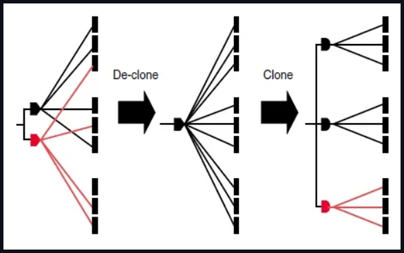

---

## 4. Retiming

Retiming is a sequential optimization where flip-flops (registers) are moved across combinational logic to balance delays without changing the overall input–output behavior.

Main ideas:
1. Model the design as a directed graph with edges carrying registers and nodes representing combinational logic.
2. Move registers forward or backward to redistribute logic between pipeline stages.
3. Preserve functional equivalence and respect constraints such as reset/enable behavior.
4. Target a shorter clock period, better slack, or improved power while maintaining correctness.

---

## 5. Labs on Optimization
```
module opt_check (input a, input b, output y);
assign y = a ? b : 0;
endmodule
```

Explanation:
- If `a` is 1, `y` follows `b`.
- If `a` is 0, `y` is 0.
- Tools can often optimize this based on how `a` and `b` are used elsewhere.

In your synthesis script (Day 1 lab flow), insert:
```
opt_clean -purge
```
between `abc -liberty` and `synth -top` to clean up unused logic.

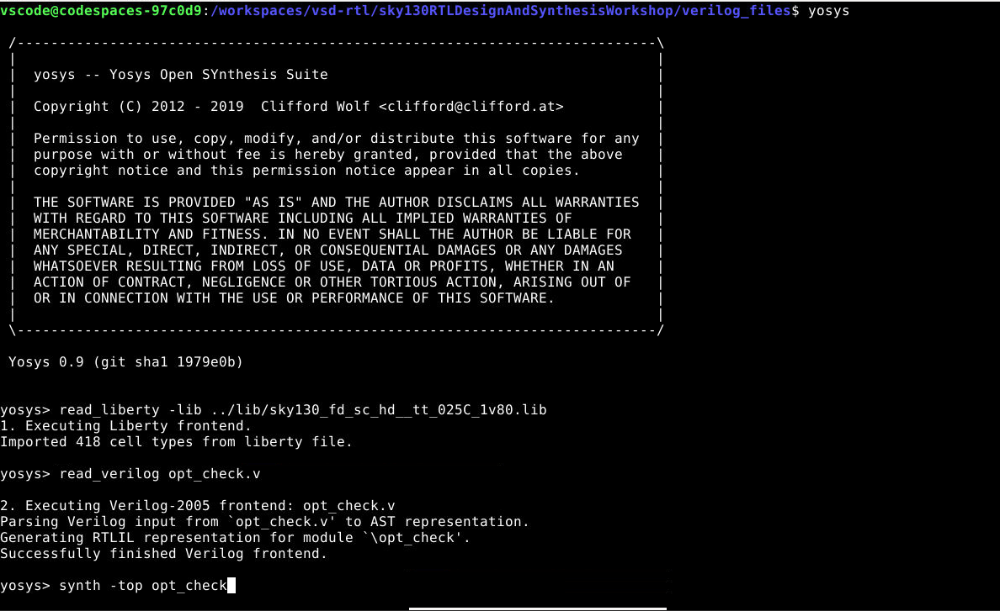
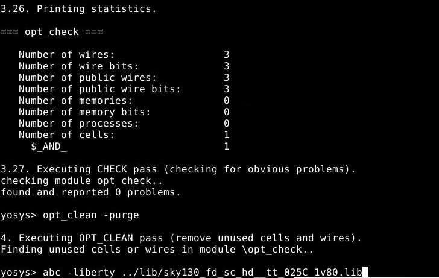
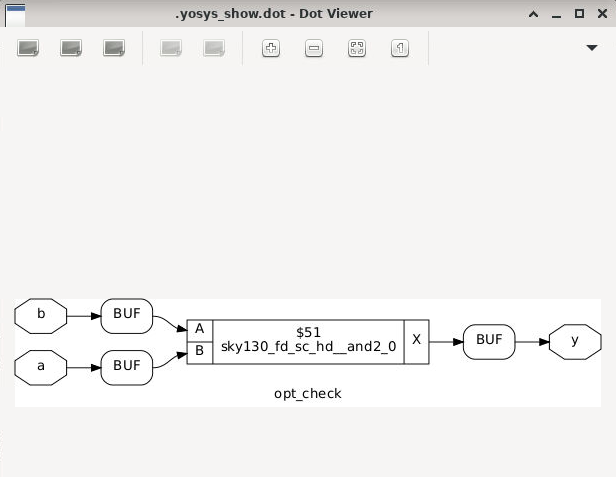

---

### Lab 2
```
module opt_check2 (input a, input b, output y);
assign y = a ? 1 : b;
endmodule
```

Behavior:
- When `a = 1`, output `y` is forced to 1.
- When `a = 0`, output `y` equals `b`.
- Functionally this is a 2:1 mux with one data input tied to logic 1.

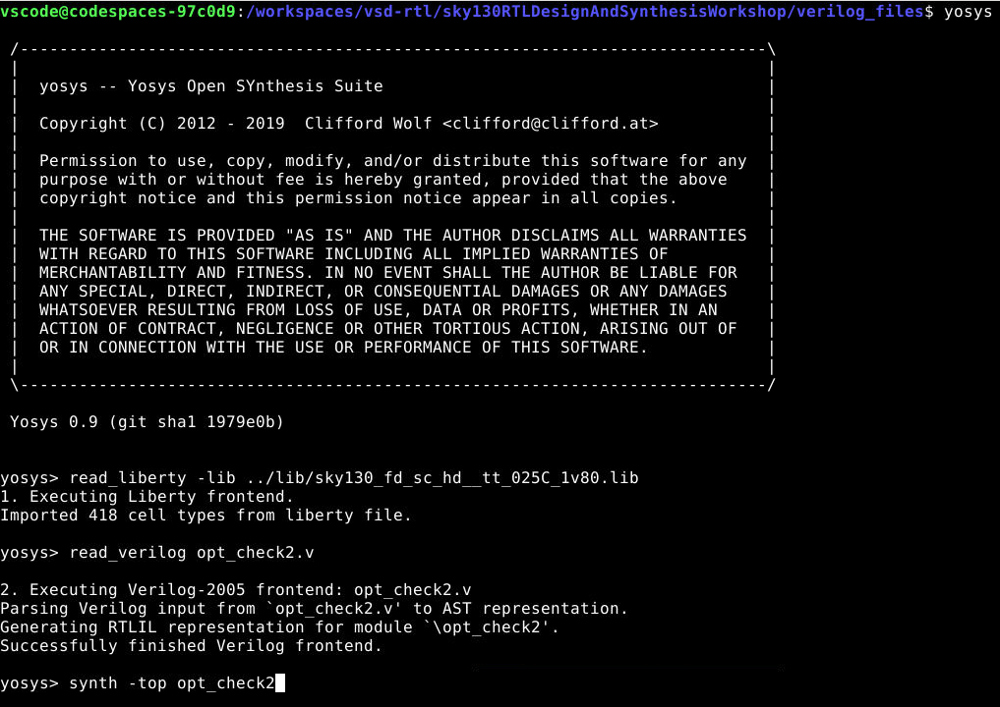
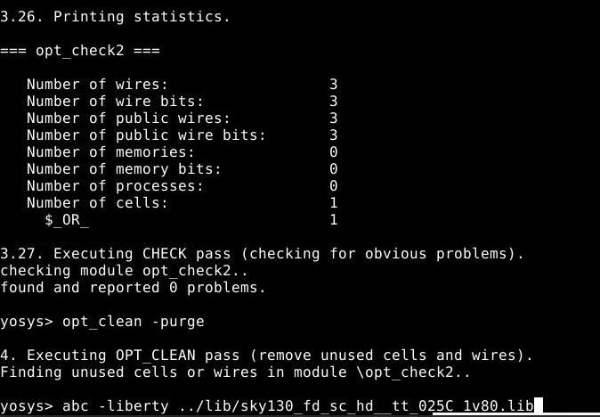
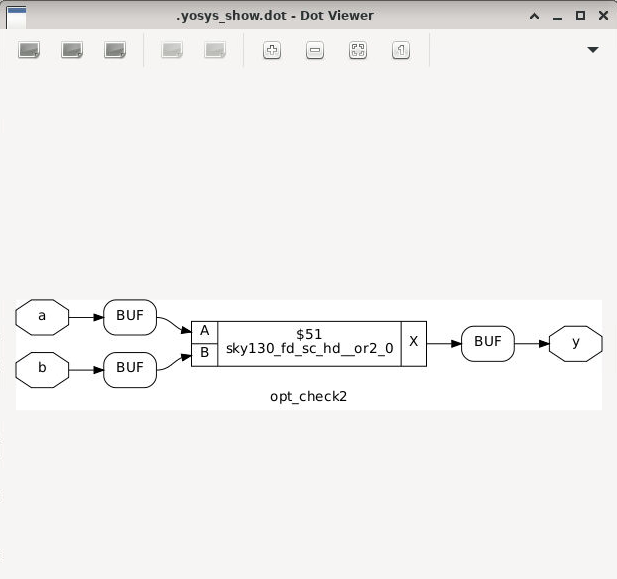

---

### Lab 3
```
module opt_check3 (input a, input b, output y);
assign y = a ? 1 : b;
endmodule
```

Functionality:
- Same logical form: `y = a ? 1 : b`.
- Acts as a mux where `a` selects between constant 1 and `b`.

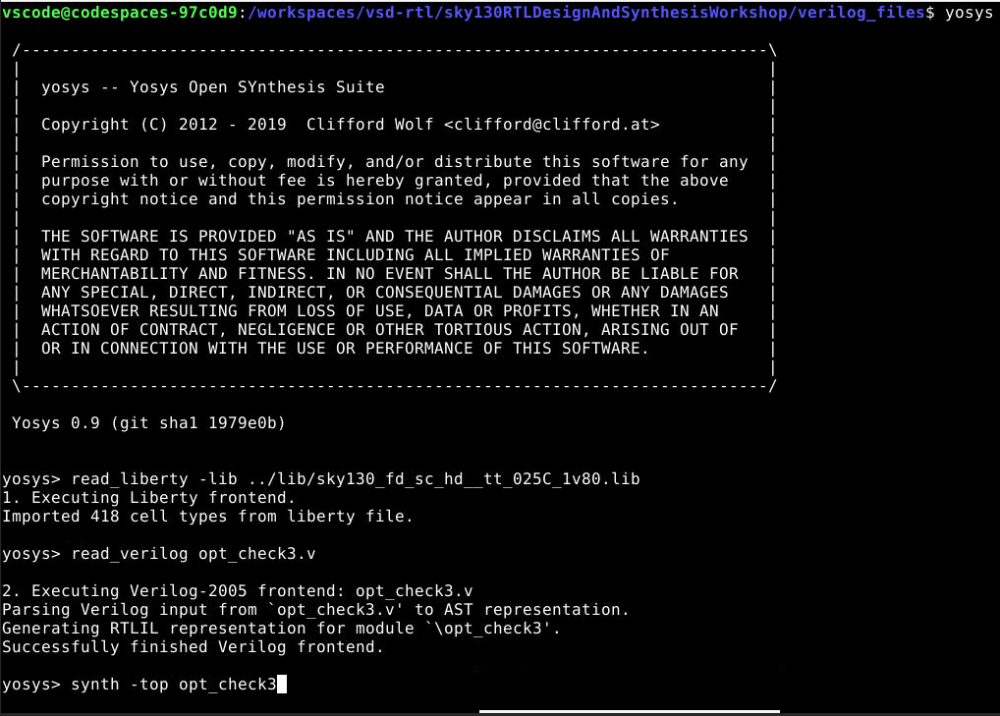
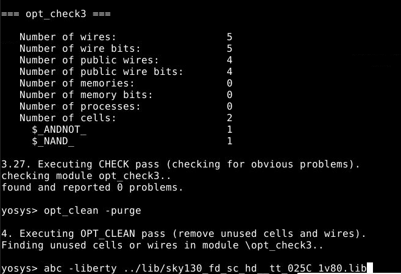
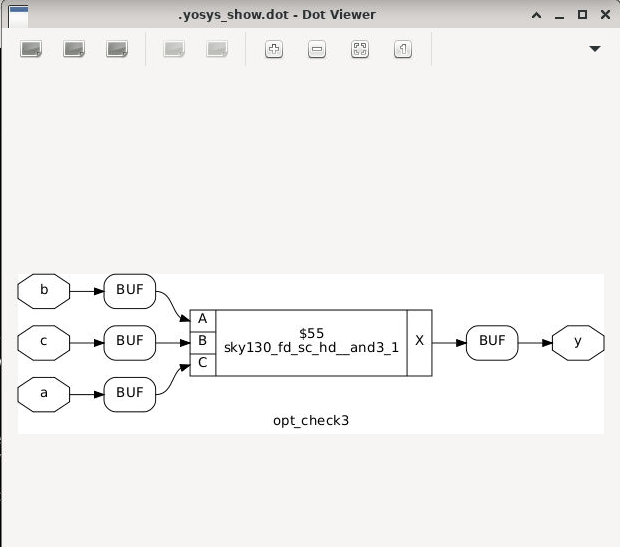

---

### opt_check4
```
module opt_check4 (input a, input b, input c, output y);
assign y = a ? (b ? (a & c) : c) : (!c);
endmodule
```

Key points:
- Three inputs: `a`, `b`, `c`.
- Nested ternary operators define `y` in terms of these inputs.
- After simplification, the logic reduces to:
  - If `a = 1`, `y = c`.
  - If `a = 0`, `y = ~c`.
- Tools will fold the extra conditions and generate a compact implementation.

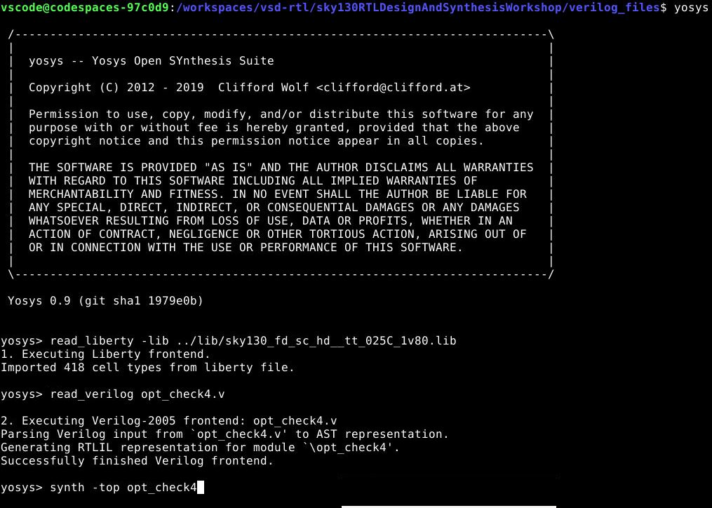

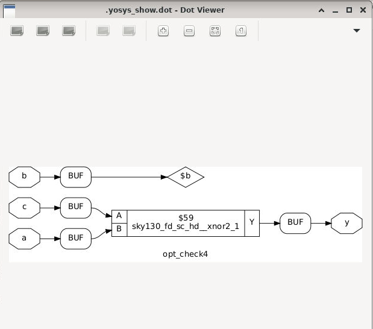

---

### multiple_modules
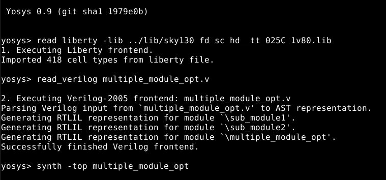
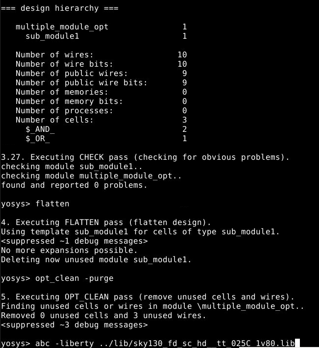
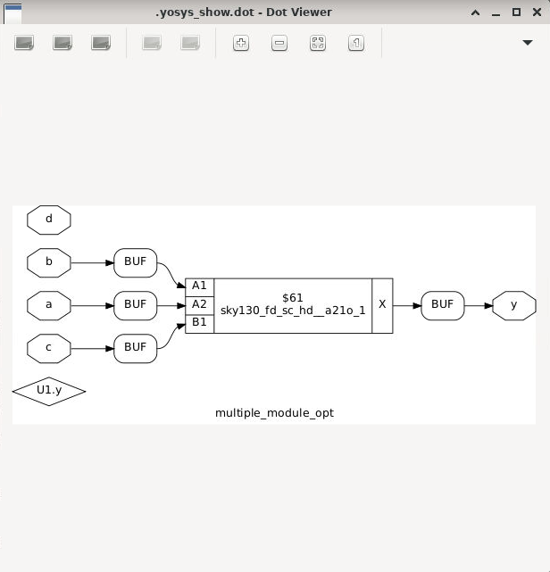

### Lab 5
```
module dff_const1 (input clk, input reset, output reg q);
always @(posedge clk or posedge reset) begin
if (reset)
q <= 1'b0;
else
q <= 1'b1;
end
endmodule
```

Behavior:
- Asynchronous reset drives `q` to 0.
- When not in reset, the flop always loads logic 1.
- Synthesis tools may replace this with a simpler structure since the steady-state value is constant.

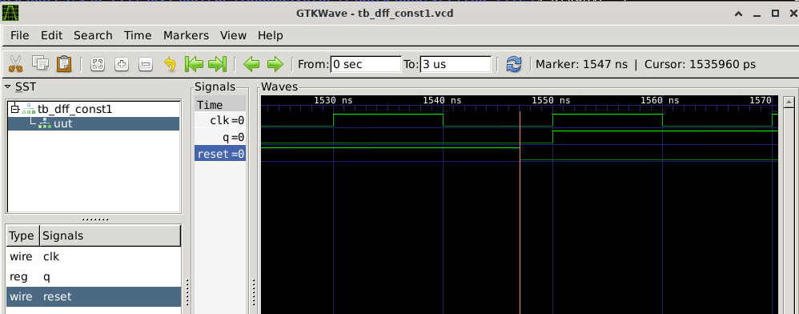
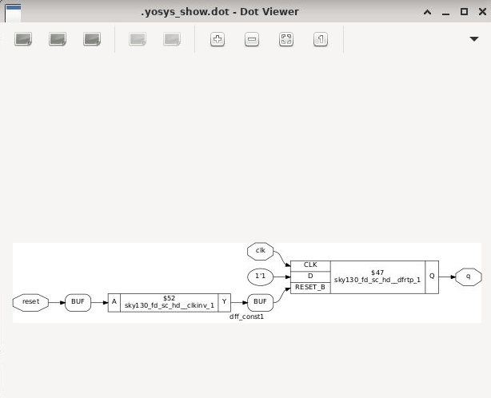

---

### Lab 6
```
module dff_const2 (input clk, input reset, output reg q);
always @(posedge clk or posedge reset) begin
if (reset)
q <= 1'b1;
else
q <= 1'b1;
end
endmodule
```

Behavior:
- Output `q` is always 1, regardless of `clk` or `reset`.
- The optimizer can remove the flop completely and replace it with a constant 1 driver in the netlist.

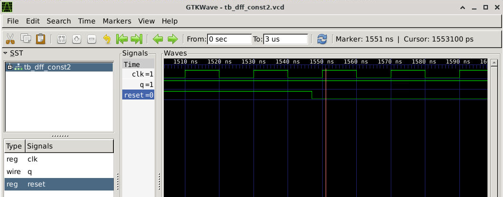
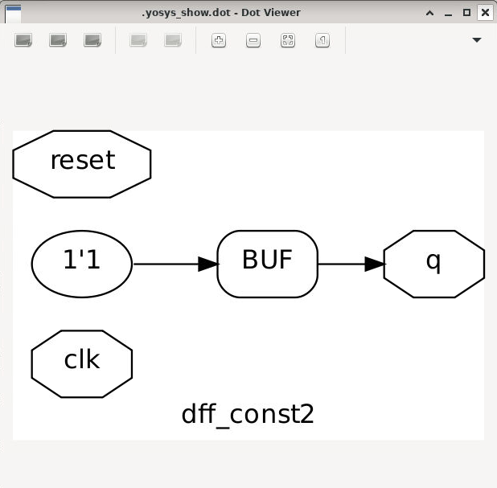

---

### dff_const3
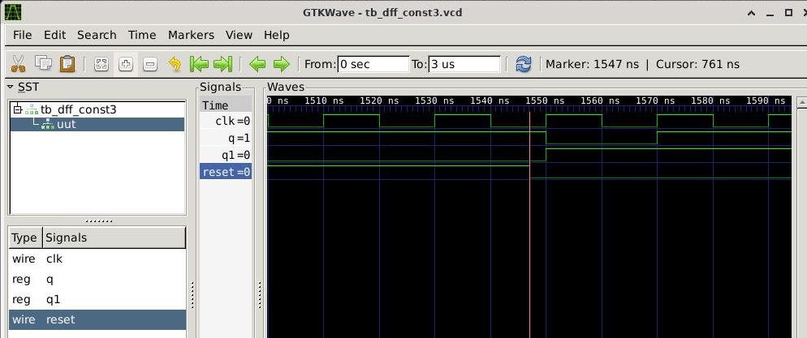
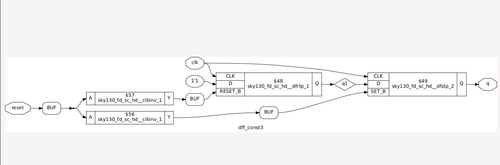

---

### dff_const4
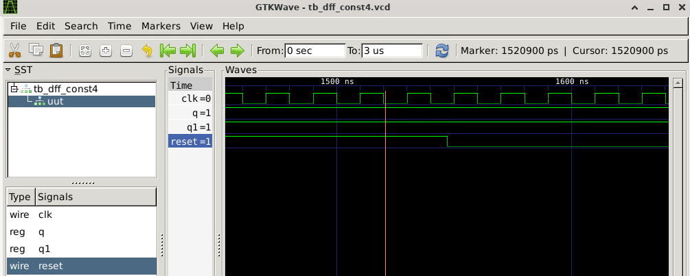
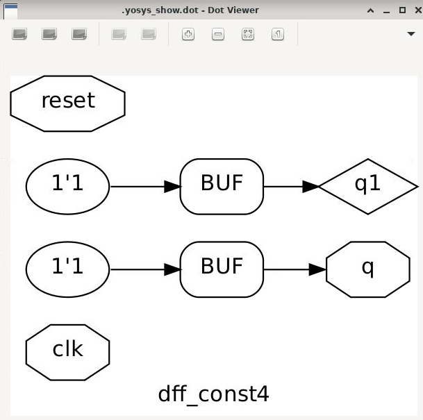

---

### dff_const5

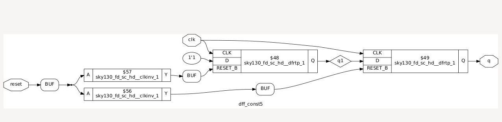

---

### counter_opt
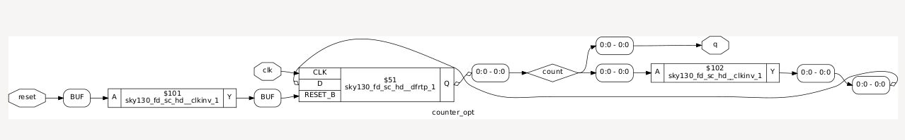

---

## Summary

- Focus: Practical optimization for combinational and sequential logic in digital design.
- Techniques:
  - Constant propagation to simplify logic with known values.
  - State optimization to refine FSMs for area, speed, and power.
  - Cloning to relieve high fanout and fix timing.
  - Retiming to reposition registers for better performance.
- Labs: Six Verilog exercises that illustrate how synthesis tools optimize both combinational circuits and flip-flop-based designs.


### Lab 1

