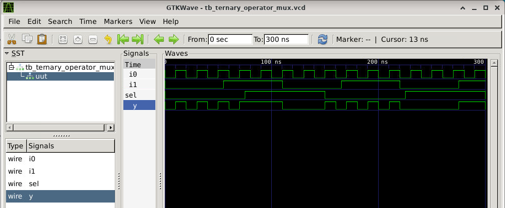
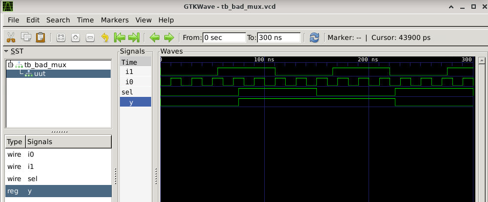
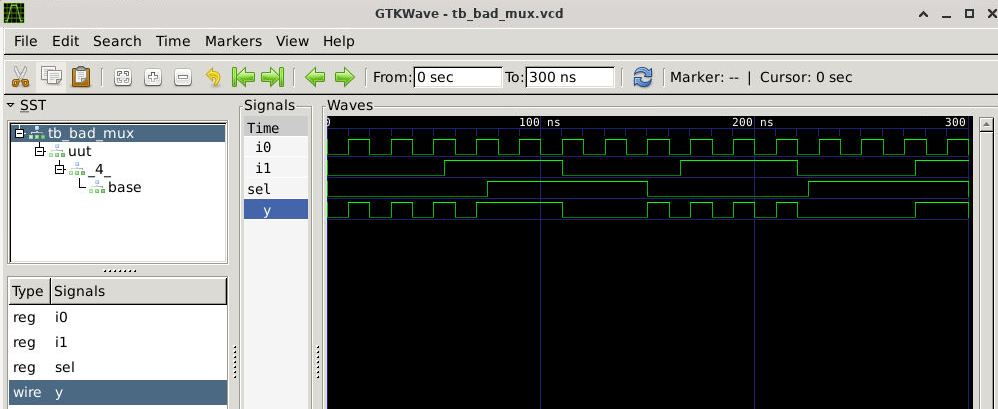
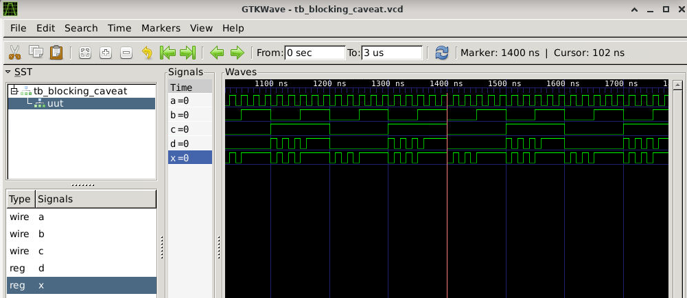

# Day 4: Gate-Level Simulation (GLS), Blocking vs Non-Blocking, Synthesis Mismatches

Day 4 covers gate-level verification, Verilog assignment semantics, and debugging synthesis-simulation differences with practical labs.

---

## Table of Contents

- [1. Gate-Level Simulation (GLS)](#1-gate-level-simulation-gls)
- [2. Synthesis-Simulation Mismatch](#2-synthesis-simulation-mismatch)
- [3. Blocking vs Non-Blocking Assignments](#3-blocking-vs-non-blocking-assignments)
  - [3.1 Blocking (`=`)](#31-blocking-)
  - [3.2 Non-Blocking (`<=`)](#32-non-blocking-)
  - [3.3 Comparison](#33-comparison)
- [4. Labs](#4-labs)
- [5. Key Takeaways](#5-key-takeaways)

---

## 1. Gate-Level Simulation (GLS)

**Gate-Level Simulation** verifies the synthesized netlist against RTL functionality and checks timing with real gate delays.

### Purpose
- Confirm synthesis preserved RTL behavior
- Validate timing using SDF-annotated delays (setup/hold violations)
- Verify DFT structures (scan chains, BIST)

### When to Run
- Post-synthesis, pre-place&route
- After timing closure for signoff

### Types
- **Zero-delay/Unit-delay**: Functional check only
- **Back-annotated timing**: Full timing validation with SDF

---

## 2. Synthesis-Simulation Mismatch

Mismatch happens when RTL sim ≠ gate-level sim or hardware. Common causes:

- Non-synthesizable code (delays, initial blocks)
- Incomplete sensitivity lists
- Ambiguous logic (missing `else`, race conditions)
- Tool interpretation differences

**Fix:** Write clear, synthesizable RTL following standard templates.

---

## 3. Blocking vs Non-Blocking Assignments
always @(*) begin
y = a & b; // Executes immediately, sequential
end
- Immediate update, left-to-right evaluation
- Use for **combinational** logic only

### 3.2 Non-Blocking (`<=`)
always @(posedge clk) begin
q <= d; // Scheduled update at timestep end
end
- Concurrent updates, all RHS evaluated first
- Use for **sequential** (registers) only

### 3.3 Comparison

| Aspect | Blocking (`=`) | Non-Blocking (`<=`) |
|--------|----------------|---------------------|
| Operator | `=` | `<=` |
| Execution | Immediate, sequential | Scheduled, parallel |
| Use case | Combinational | Sequential/Regs |
| Sim behavior | Like C assignments | Hardware-like |

---

## 4. Labs

### Lab 1: Ternary MUX
module ternary_mux (input i0, i1, sel, output y);
assign y = sel ? i1 : i0;
endmodule

```
read_liberty sky130_fd_sc_hd__tt_025C_1v80.lib
read_verilog ternary_mux.v
synth -top ternary_mux
abc -liberty sky130_fd_sc_hd__tt_025C_1v80.lib
write_verilog -noattr ternary_operator_mux_netlist.v
iverilog ../my_lib/verilog_modelprimitives.v ../my_lib/verilog_modelsky130_fd_sc_hd.v ternary_mux.v tb_ternary_mux.v
./a.out
gtkwave tb_ternary_mux.vcd
```
### Before synthesis

### After Synthesis


---

### Lab 2: Bad MUX
module bad_mux (input i0, i1, sel, output reg y);
always @(sel) begin // Incomplete sensitivity!
if (sel) y <= i1; else y <= i0;
end
endmodule

```
read_liberty sky130_fd_sc_hd__tt_025C_1v80.lib
read_verilog bad_mux.v
synth -top bad_mux
abc -liberty sky130_fd_sc_hd__tt_025C_1v80.lib
write_verilog -noattr bad_mux_netlist.v
iverilog ../my_lib/verilog_model/primitives.v ../my_lib/verilog_model/sky130_fd_sc_hd.v bad_mux.v tb_bad_mux.v
./a.out
gtkwave tb_bad_mux.vcd
```
### Before synthesis

### After Synthesis


---
### Lab 3: BLocking Caveat
module blocking_caveat (input a, b, c, output reg d);
reg x;
always @(*) begin
d = x & c; // Uses OLD x!
x = a | b; // Too late
end
endmodule

```
read_liberty sky130_fd_sc_hd__tt_025C_1v80.lib
read_verilogblocking_caveat.v
synth -top blocking_caveat
abc -liberty sky130_fd_sc_hd__tt_025C_1v80.lib
write_verilog -noattr blocking_caveat_netlist.v
iverilog ../my_lib/verilog_model/primitives.v ../my_lib/verilog_model/sky130_fd_sc_hd.v blocking_caveat.v tb_blocking_caveat.v
./a.out
gtkwave tb_blocking_caveat.vcd
```
### Before synthesis

### After Synthesis


---

## 5. Key Takeaways

> [!IMPORTANT]
> - **GLS validates** your synthesis results
> - **Blocking (`=`) → combo logic** | **Non-blocking (`<=`) → sequential**
> - **Always sim both RTL + gate-level**
> - **Fix sensitivity lists** and **assignment order**
> - **Review all tool warnings**

---

---


### 3.1 Blocking (`=`)

