# Day 5: Verilog Synthesis - Avoiding Latches, Loops & Scalable Hardware

Day 5 dives into synthesis pitfalls like unintended latches from incomplete conditionals, plus practical use of for loops and generate constructs for parameterized designs. Labs demonstrate both broken and working examples.

---

## Contents

- [1. Conditional Logic](#1-conditional-logic)
- [2. Unwanted Latch Creation](#2-unwanted-latch-creation)
- [3. Conditional Labs](#3-conditional-labs)
- [4. For Loops](#4-for-loops)
- [5. Generate Constructs](#5-generate-constructs)
- [6. Ripple Carry Adder Basics](#6-ripple-carry-adder-basics)
- [7. Advanced Loop Labs](#7-advanced-loop-labs)
- [Summary](#summary)

---

## 1. Conditional Logic

**If-else chains** implement decision logic inside procedural blocks for behavioral modeling.

### Basic Form
if (test_expr) begin
// Execute when true
end else if (test_expr2) begin
// Alternative condition
end else begin
// Catch-all case
end

**Rule:** Every output **must** get assigned regardless of input combinations in combo blocks.

---

## 2. Unwanted Latch Creation

**Latches appear** when combo logic (`always @(*)`) leaves some outputs un-driven in certain conditions. Synthesis tools create memory elements you didn't intend.

### Problem Case
always @(*) begin
if (enable) out = data; // What happens when enable=0?
end

### Proper Fix
always @(*) begin
case(enable)
1'b1: out = data;
default: out = 1'b0; // Always assigned
endcase
end

---

## 3. Conditional Labs

### Lab 1: Missing Assignment Path
module missing_path (input i0, i1, i2, output reg y);
always @(*) begin
if (i0) y <= i1; // No fallback → latch created
end
endmodule
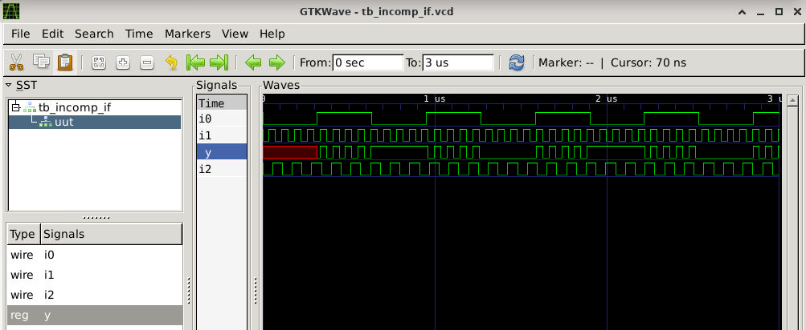

### Lab 2: Result After Synthesis
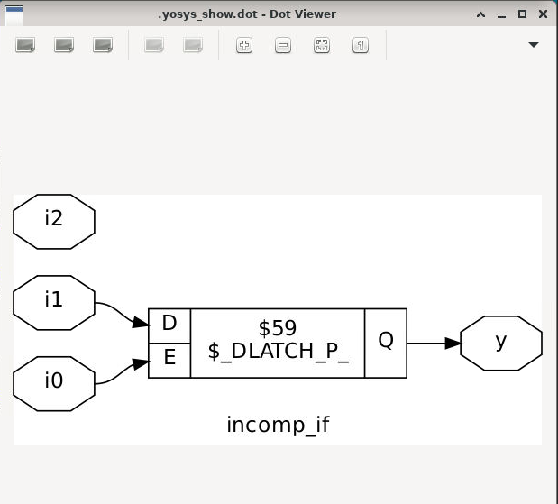

### Lab 3: Chained Conditions (Incomplete)
module chain_missing (input i0,i1,i2,i3, output reg y);
always @(*) begin
if (i0) y <= i1;
else if (i2) y <= i3; // Gap when both false
end
endmodule
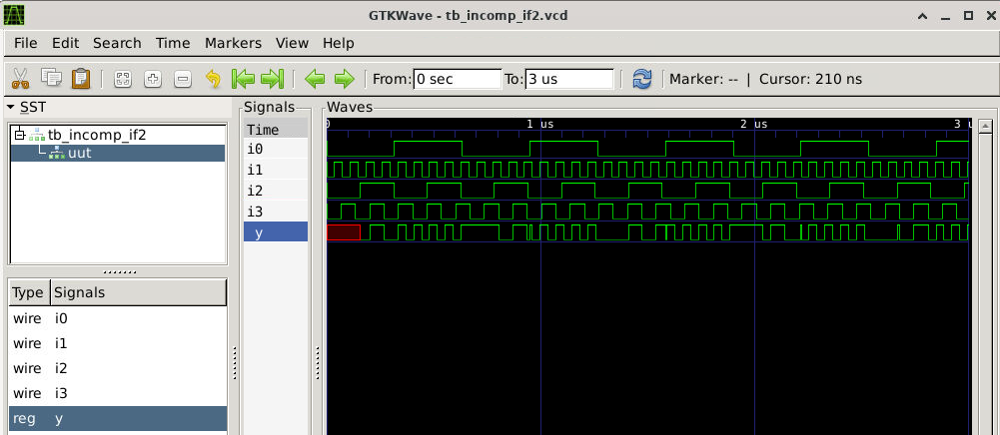

### Lab 4: Synthesis Output
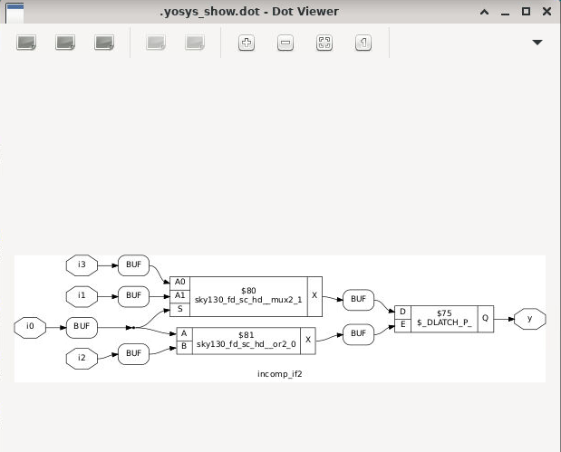

### Lab 5: Full Coverage Case
module safe_case (input i0,i1,i2, input [1:0] sel, output reg y);
always @(*) begin
case(sel)
2'b00: y = i0;
2'b01: y = i1;
default: y = i2; // Covers all possibilities
endcase
end
endmodule
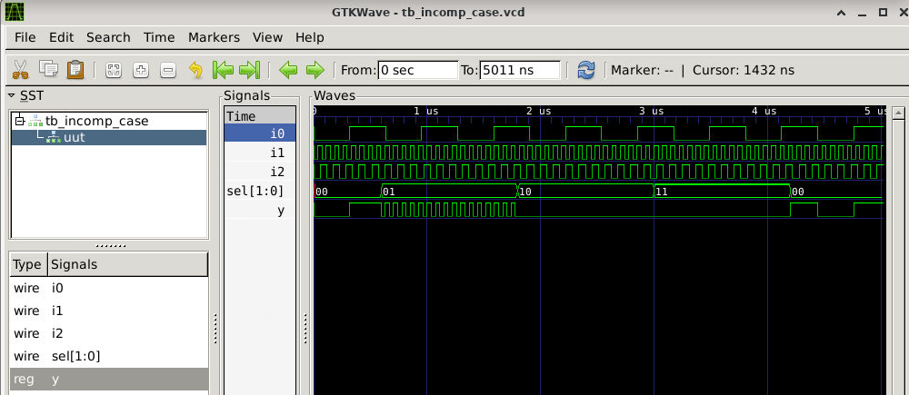

### Lab 6: Clean Synthesis

### Lab 7: Overlapping Patterns
module overlap_case (input i0,i1,i2,i3, input [1:0] sel, output reg y);
always @(*) begin
case(sel)
2'b00: y = i0;
2'b01: y = i1;
2'b10: y = i2;
2'b1?: y = i3; // Wildcard creates priority issues
endcase
end
endmodule
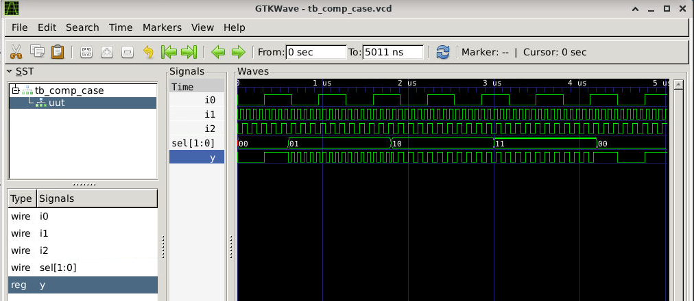

### Lab 8: Selective Assignments
module selective_assign (input i0,i1,i2, input [1:0] sel, output reg y,x);
always @(*) begin
case(sel)
2'b00: begin y=i0; x=i2; end
2'b01: y = i1; // x forgotten here!
default: begin x=i1; y=i2; end
endcase
end
endmodule

### Partial Case
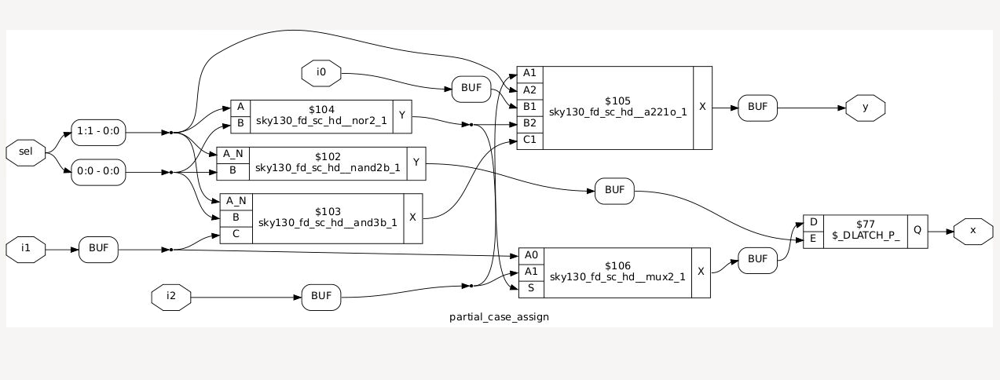

### Bad Case
### Before synthesis
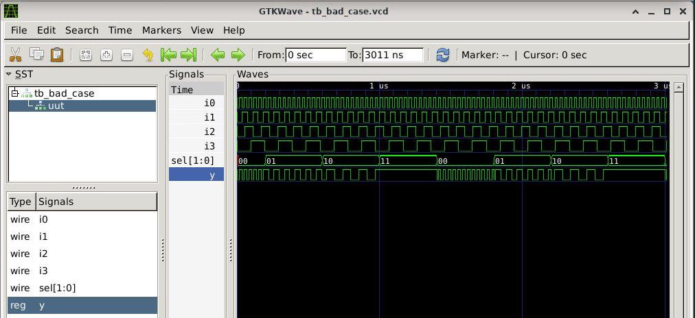
### After synthesis
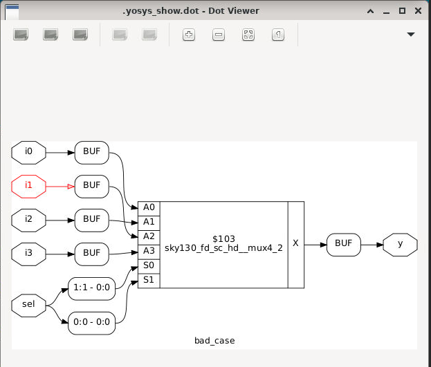
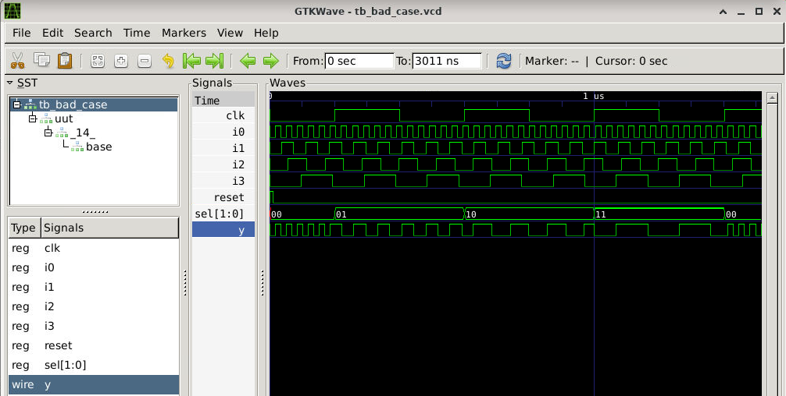
> **Reference Day 1** for complete synthesis workflow.

---

## 4. For Loops

**Iterative loops** execute the same code multiple times. Only synthesizable with **constant iteration limits**.

### 4-Input Selector Example
module mux4_loop (input [3:0] inputs, input [1:0] select, output reg out);
integer idx;
always @(*) begin
out = 1'b0;
for (idx=0; idx<4; idx=idx+1)
if (idx == select) out = inputs[idx];
end
endmodule

---

## 5. Generate Constructs

**Generate statements** instantiate modules or logic **statically at elaboration time**.

### Pattern
genvar idx;
generate
for (idx=0; idx<WIDTH; idx=idx+1) begin : adder_array
full_adder fa_inst (.a(a[idx]), .b(b[idx]), .sum(s[idx]));
end
endgenerate

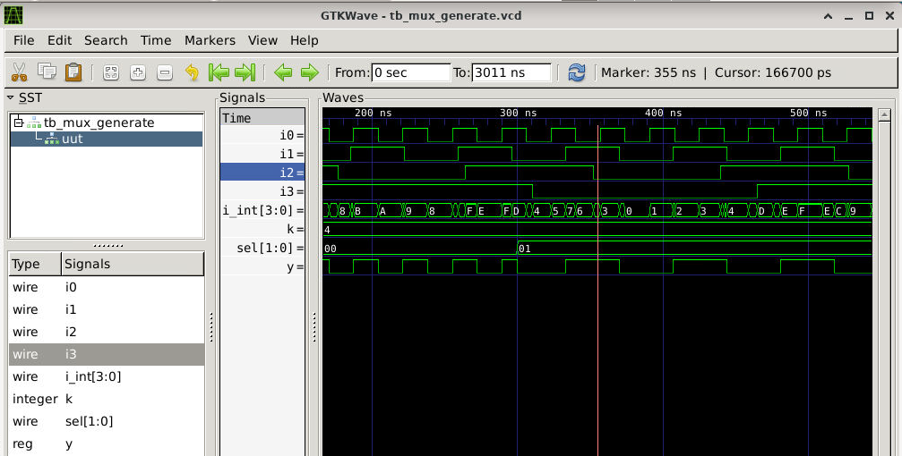
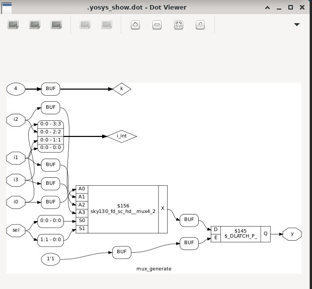

---

## 6. Ripple Carry Adder Fundamentals

**Ripple Carry Adder** links full adders in series - each carry propagates to the next stage sequentially.

Bit0: FA0 → carry1
Bit1: FA1(cin=carry1) → carry2
Bit2: FA2(cin=carry2) → ...

---

## 7. Advanced Loop Labs

### Lab 9: 4-Way Selector (Loop)
module mux4_param (input i0,i1,i2,i3, input [1:0] sel, output reg y);
wire [3:0] packed = {i3,i2,i1,i0};
integer idx;
always @(*) begin
for (idx=0; idx<4; idx=idx+1)
if (idx == sel) y = packed[idx];
end
endmodule

### Lab 10: 8-Way Distributor (Case)
module demux8_case (output [7:0] outs, input [2:0] sel, input data);
reg [7:0] result;
assign outs = result;
always @(*) begin
result = 8'b0;
case(sel)
3'd0: result = data;
3'd1: result = data;​
// ... through 3'd7
3'd7: result = data;​
endcase
end
endmodule

### Lab 11: 8-Way Distributor (Loop)
module demux8_loop (output [7:0] outs, input [2:0] sel, input data);
reg [7:0] result;
assign outs = result;
integer idx;
always @(*) begin
result = 8'b0;
for (idx=0; idx<8; idx=idx+1)
if (idx == sel) result[idx] = data;
end
endmodule
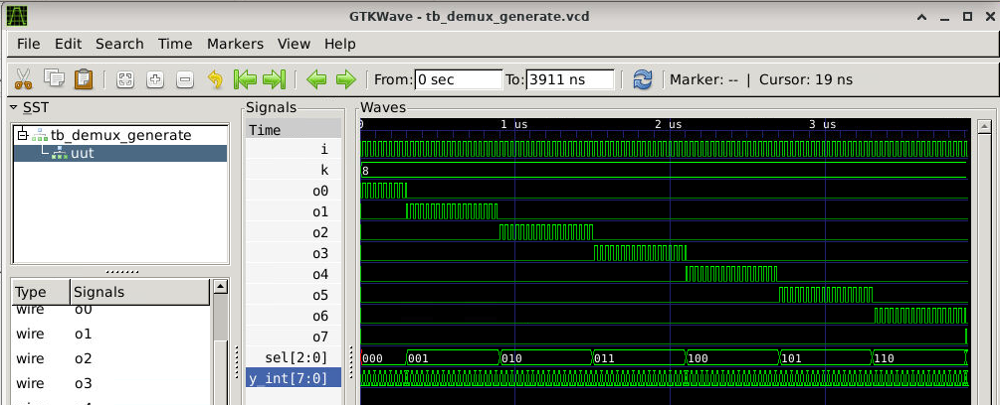

### Lab 12: 8-Bit Adder Array (Generate)
module adder_chain (input [7:0] op1, op2, output [8:0] result);
wire [7:0] carries, partial_sums;

full_adder first (.a(op1), .b(op2), .cin(1'b0),
.sum(partial_sums), .cout(carries));

genvar bit;
generate
for (bit=1; bit<8; bit=bit+1) begin : adder_stages
full_adder stage (.a(op1[bit]), .b(op2[bit]), .cin(carries[bit-1]),
.sum(partial_sums[bit]), .cout(carries[bit]));
end
endgenerate

assign result = {carries, partial_sums};​
endmodule

module full_adder (input a,b,cin, output sum, cout);
assign {cout, sum} = a + b + cin;
endmodule
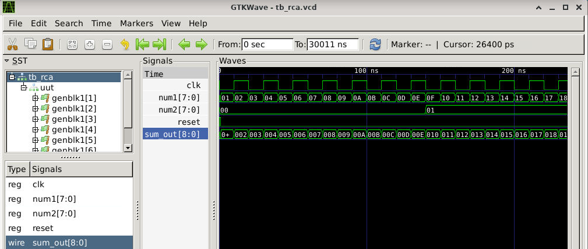

---

## Summary

> [!WARNING]
> - **Complete all paths** in conditional combo logic
> - **Constant bounds only** for synthesizable loops
> - **Generate scales** module replication cleanly
> - **Heed synthesis warnings** about latches!

---

